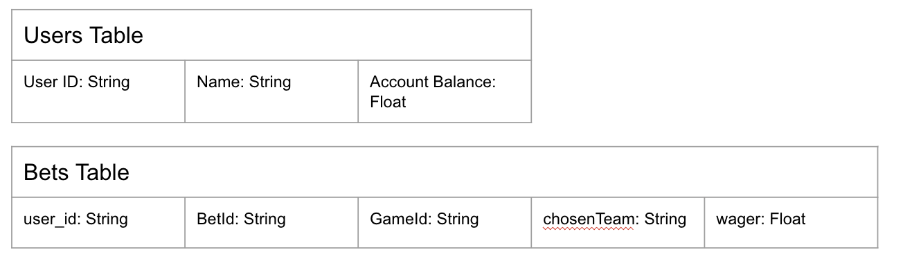

# Rails Backend Wagering API

This application creates a backend API for frontend consumption. The purpose of this project is to teach Rails principals in creating and serving an API. This app will simulate an API serving multiple users, games, and bets that can be created, fetched, or mutated. 

## Running the Program
To run the rails appllication run the following command in the wager_api directory. 

```ruby
bin/rails server
```

The rails application will be running on localhost:3000 by default. If you wish to run this application on another port, run the following.

```ruby
bin/rails server -p [port number]
```

To exit the program, type in control + c in your terminal. 

## Testing
While inside the wager_api directory, run the command below.

```ruby
bin/rails test
```

Note: To run the test continously ```mix test.watch``` is also available. This will refresh the test suite after changes to a file are saved.

## Models 
The model portion of the API consist of three tables. These are Users, Games, and Bets respectively. Each user, game, or bet, have a unique ID and referenced by the ID respectively. The schema of the tables and their respective fields are represented below.



## Contributors

The initial wager_api program was created by Pedro Lopez under the guidance and oversight of Dave Torre, Matt Readout, Joey Shipley, & Tiffani Elmore. 